## Setting up the Repository

### Creating the Repository

1. Just click on create new project on an appropriate Gitlab sub-group
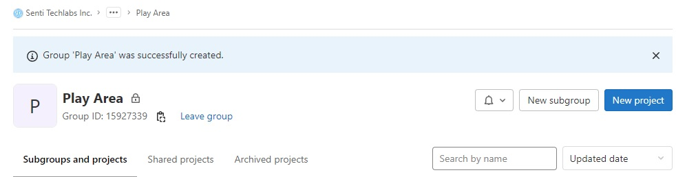

2. Then pick "Create Blank Project".
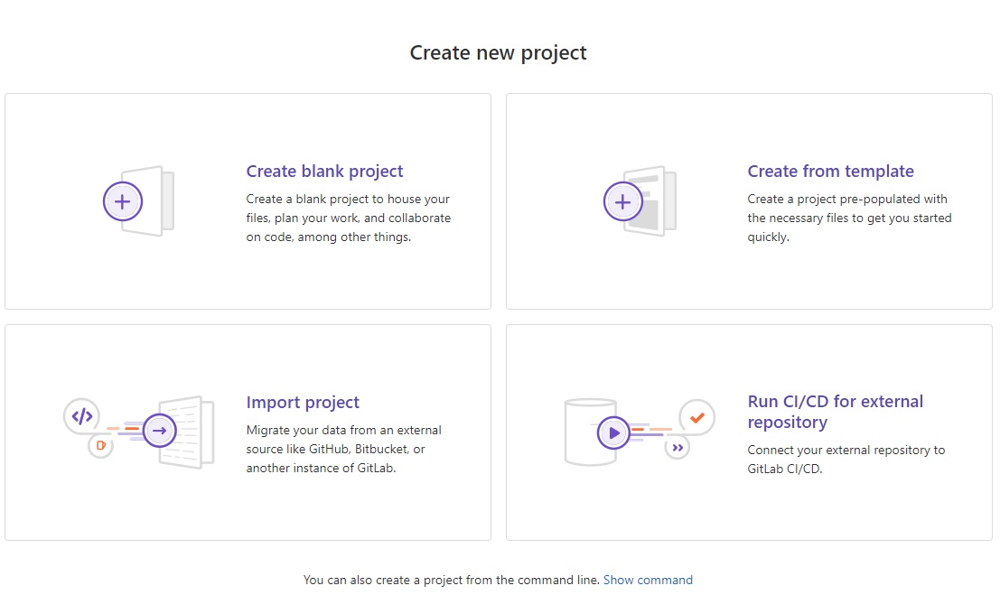

3. On the name and description, write name and description it with this ruleset:
[A/P]-[Client/Product]-[ProjectName]-[RepositoryName]
    - A/P, use `A` if it is a client project, `P` if it is an internal or product project
    - The name of the Client or the Product
    - The project name where this repository belongs to
    - The repository name

    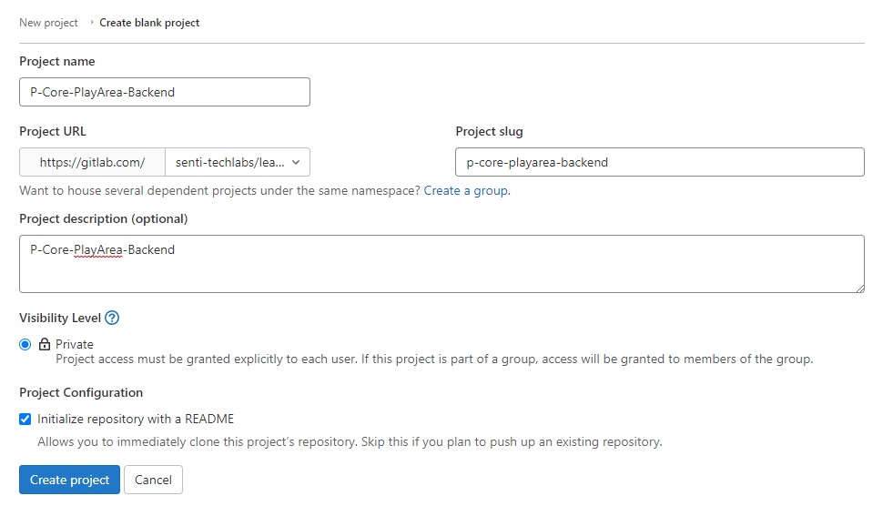

    
    For this example, we have picked `P-Core-PlayArea-Backend` because is a backend repository for the project `PlayArea` under the `Core` internal project, which makes the prefix `P`.
    


4. Make sure the Initialize Readme is ticked (turned on). And then create repository.
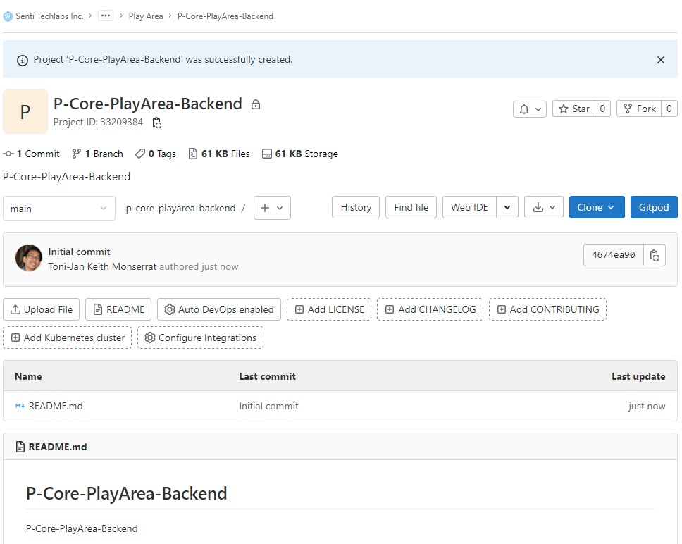

### Configuring the repository

1. Go to Settings > CI/CD
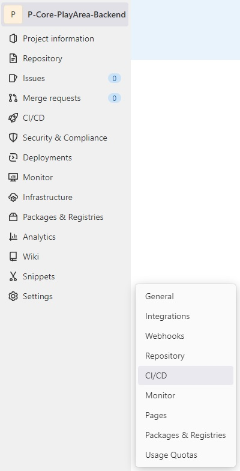

2. Expand Variable options
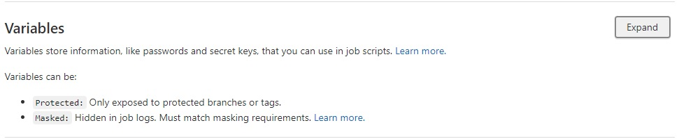

3. We need to add the following variables
    - `GCLOUD_BUILD_DEPLOY_KEY`: Service account of the Google Dev Project
    - `GCLOUD_TEST_KEY`: Service account of the Google Dev Project
    - `GOOGLE_TEST_ENV`: the name of the secret key that holds the test environment configuration
    - `GOOGLE_BUILD_DEPLOY_DEV_ENV`: the name of the secret key that holds the deployment configuration for the development environment
    - `GOOGLE_BUILD_DEPLOY_STAGING_ENV`: the name of the secret key that holds the deployment configuration for the staging environment
    - `GOOGLE_BUILD_DEPLOY_UAT_ENV`: the name of the secret key that holds the deployment configuration for the UAT environment
    - `GOOGLE_BUILD_DEPLOY_PRODUCTION_ENV`: the name of the secret key that holds the deployment configuration for the production environment
    - `GOOGLE_PROJECT_ID`: the google project ID of the project that holds the service account and secret keys
    - `SENTRY_AUTH_TOKEN`: the sentry auth token. Get it from Sentry
    - `SENTRY_ORG`: The sentry organization - the value is: `senti-techlabs`
    - `SENTRY_PROJECT`: the sentry project, the value is same as the repository slug-name
    - `SONAR_TOKEN`: the sonar token to allow scanning. Get it from Sonarcloud (see instructions below)

    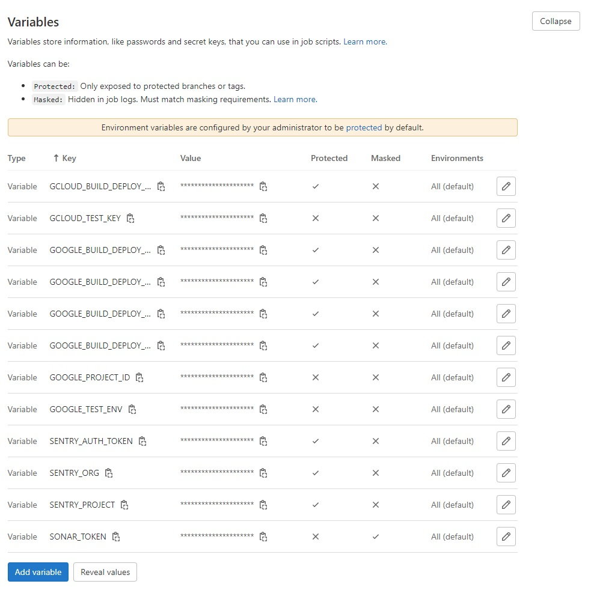

    See following instructions on how to get the values for each variable, as well as the options when saving.

#### Getting the Service Account Keys

1. Go to the Google Project
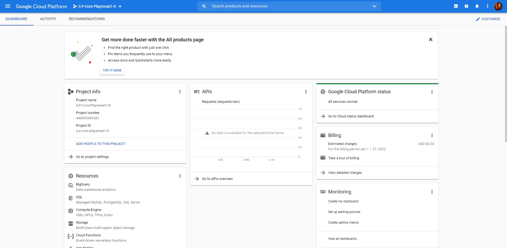

    Prerequisite
    - Make sure that APIs for Cloud Run and Cloud Build are enabled
    - Make sure there is a Cloud Storage, Regional, Standard, Not Public for builds
    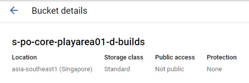

2. Go to IAM > Service Accounts
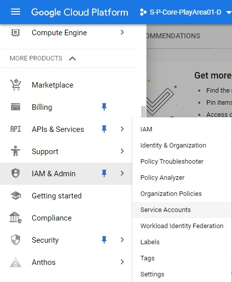

3. If we are creating a new Service account, Click `+ Create Service Account`
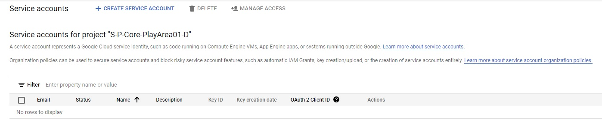

4. Add a name. For the example below, we put `gitlab-tester`
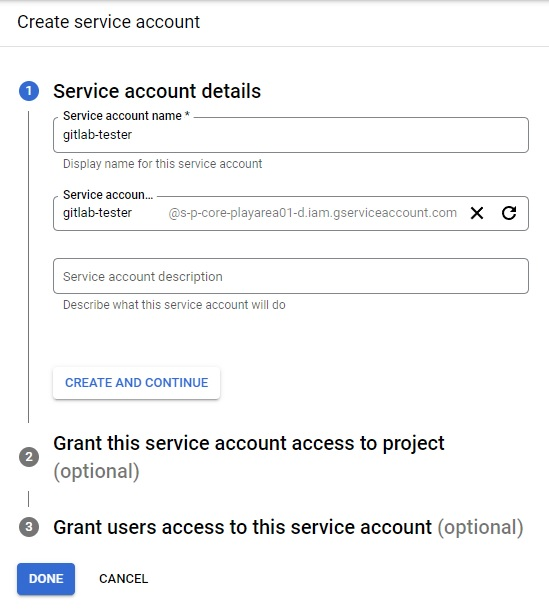

5. Click on `...` and `Manage Keys`
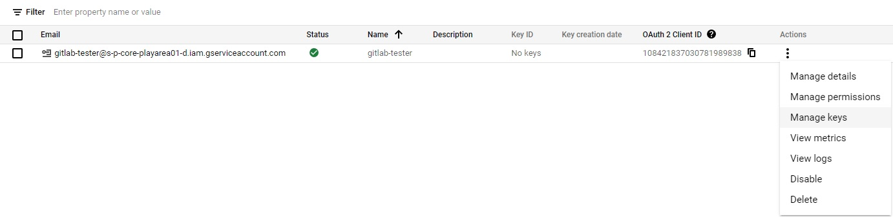

### Setting up the Boilerplate code

1. Open the Repository through Gitpod (make sure the Gitpod Extension is installed in your browser).


2. On the VSCode, open the terminal.
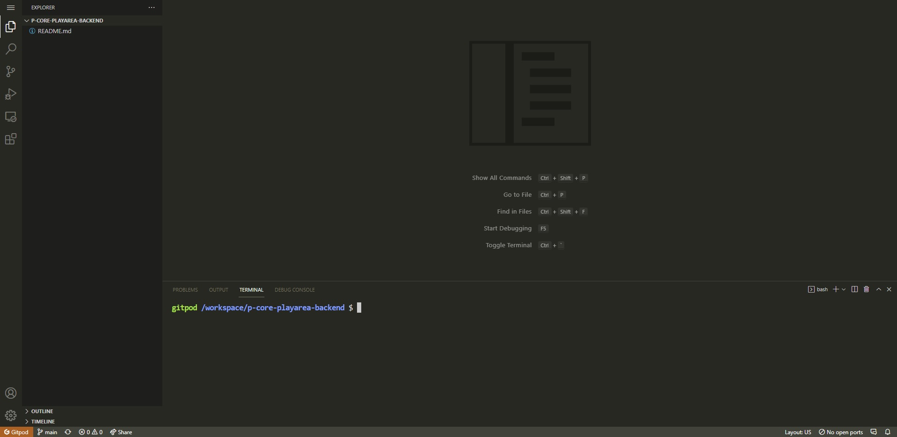

3. On the terminal, type this command line to install the boilerplate code
    ```bash
    npm i -g yo @senti-techlabs/generator-senti-project-template
    ```

4. After installation, type this command line to start the generator
    ```bash
    yo
    ```

5. Pick `@senti Techlabs/senti Project Template`
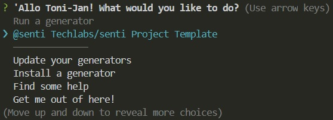

6. Press "Enter" to enter default values or change values for the following questions.
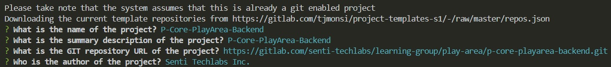

7. Pick `Cloud Run Fastify Backend Template`
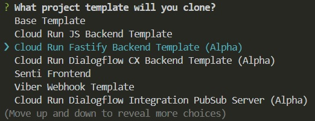

8. Wait for it to install
